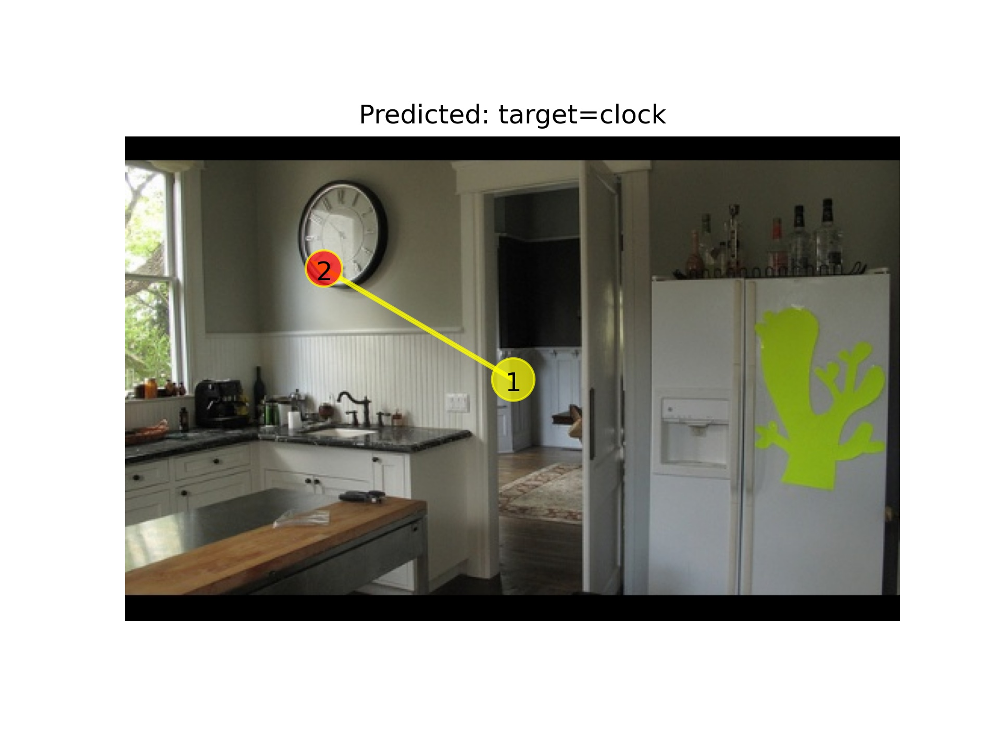
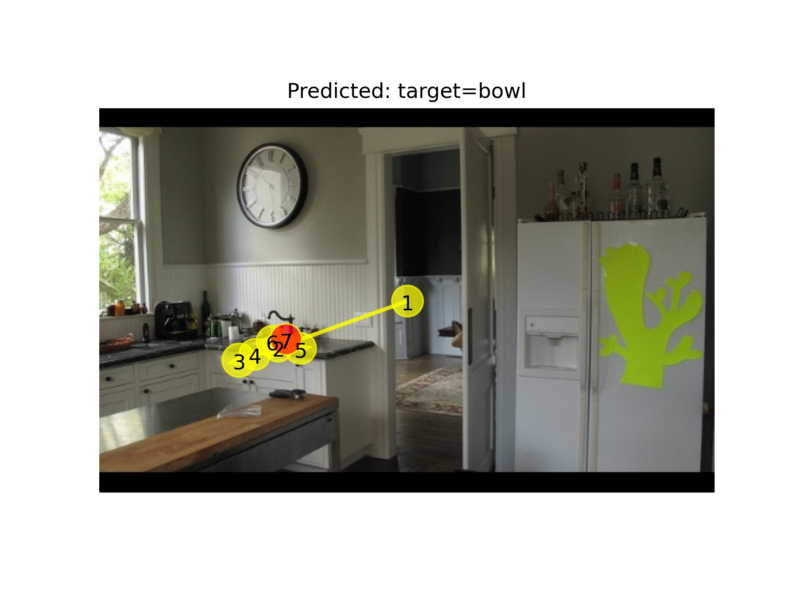
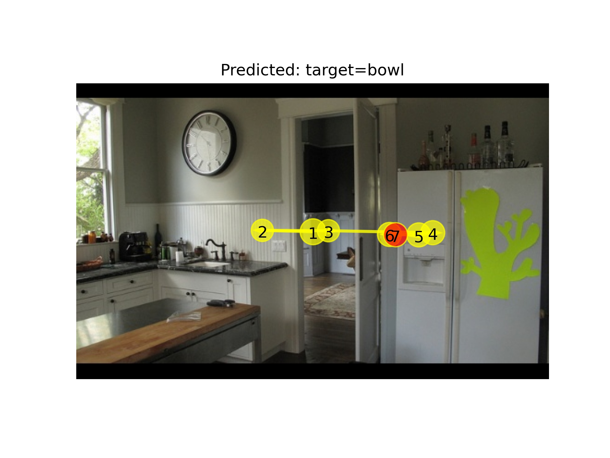

python train.py --sc_ior True --max_len 7 --num_encoder 2 \
 --net_name fastgaze-t --num_decoder 2 --hidden_dim 256 --lm_hidden_dim 512 --img_hidden_dim 2048 --batch_size 64 --epochs 300 --cuda=7

python test.py --trained_model=./model_zoo/fastgaze-T.pkg \
--sc_mask True --sc_ior True --max_len 7 \
--lm_hidden_dim=512 --num_encoder 2 --num_decoder 2 --hidden_dim 256 --img_hidden_dim 2048 --cuda=6

python test.py --trained_model=./model_zoo/fastgaze-S.pkg \
--sc_mask True --sc_ior True --max_len 7 \
--lm_hidden_dim=512 --num_encoder 3 --num_decoder 3 --hidden_dim 256 --img_hidden_dim 2048 --cuda=5

python test.py --trained_model=./model_zoo/fastgaze-B.pkg \
--sc_mask True --sc_ior True --max_len 7 \
--lm_hidden_dim=512 --num_encoder 3 --num_decoder 3 --hidden_dim 512 --img_hidden_dim 2048 --cuda=4

python plot_scanpath1_compare_asp.py  --trained_model=FastGazeT \
--dataset_dir=/zjh/data/FastGaze-cocosearch --nptask clock --task clock --imgfile 000000315319.jpg \
--sc_mask True --sc_ior True --max_len 7 --emlength 7 --lm_hidden_dim 512 --hidden_dim 256 --num_encoder 2 --num_decoder 2 --img_hidden_dim 2048 --cuda=4

python plot_scanpath1_compare_asp.py  --trained_model=FastGazeT \
--dataset_dir=/zjh/data/FastGaze-cocosearch --nptask clock --task bottle --imgfile 000000315319.jpg \
--sc_mask True --sc_ior True --max_len 7 --emlength 7 --lm_hidden_dim 512 --hidden_dim 256 --num_encoder 2 --num_decoder 2 --img_hidden_dim 2048 --cuda=4

# Visualization

python plot_scanpath1.py --trained_model=FastGazeS --condition=absent  \
--dataset_dir=/zjh/data/FastGaze-cocosearch --task knife --imgfile 000000170658.jpg \
--sc_mask True --sc_ior True --max_len 7 --emlength 7 --lm_hidden_dim 512 --hidden_dim 256 --num_encoder 3 --num_decoder 3 --img_hidden_dim 2048 --cuda=4

## TP clock

## TA bowl

## freeview

