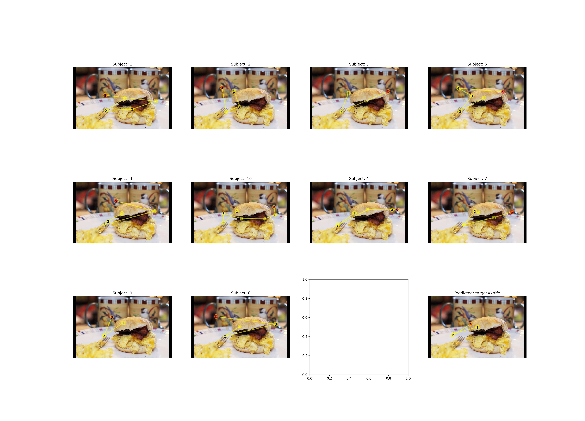

# Target-absent

# Train

python train.py --dataset_dir=/zjh/data/FastGaze-cocosearch --img_ftrs_dir=/zjh/data/FastGaze-cocosearch/image_features \
--train_file coco_search18_fixations_TA_train.json --valid_file coco_search18_fixations_TA_valid.json --model_root ./saved_models/trained-TA --condition absent \
--net_name fastgaze --sc_ior True --max_len 7 --num_encoder 2 \
--num_decoder 2 --hidden_dim 256 --lm_hidden_dim 512 --img_hidden_dim 2048 --batch_size 32 --epoch 200 --cuda=4

# Test

python test.py --trained_model=./model_zoo/fastgaze-B.pkg \
--sc_mask True --sc_ior True  --max_len 7 \
--lm_hidden_dim=512 --num_encoder 3 --num_decoder 3 --hidden_dim=512 --img_hidden_dim 2048 \
--dataset_dir=/zjh/data/1/FastGaze-cocosearch --img_ftrs_dir=/zjh/data/1/FastGaze-cocosearch/image_features --cuda=7

python test.py --trained_model=./model_zoo/fastgaze-S.pkg \
--sc_mask True --sc_ior True  --max_len 7 \
--lm_hidden_dim=512 --num_encoder 3 --num_decoder 3 --hidden_dim=256 --img_hidden_dim 2048 \
--dataset_dir=/zjh/data/1/FastGaze-cocosearch --img_ftrs_dir=/zjh/data/1/FastGaze-cocosearch/image_features --cuda=6

python test.py --trained_model=./model_zoo/fastgaze-T.pkg \
--sc_mask True --sc_ior True  --max_len 7 \
--lm_hidden_dim=512 --num_encoder 2 --num_decoder 2 --hidden_dim=256 --img_hidden_dim 2048 \
--dataset_dir=/zjh/data/1/FastGaze-cocosearch --img_ftrs_dir=/zjh/data/1/FastGaze-cocosearch/image_features --cuda=5

# Visualization

python plot_scanpath1.py --trained_model=FastGazeS --condition=absent  \
--dataset_dir=/zjh/data/FastGaze-cocosearch --task knife --imgfile 000000170658.jpg \
--sc_mask True --sc_ior True --max_len 7 --emlength 7 --lm_hidden_dim 512 --hidden_dim 256 --num_encoder 3 --num_decoder 3 --img_hidden_dim 2048 --cuda=4

