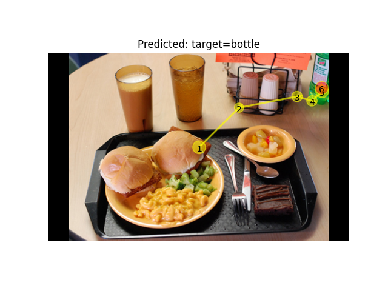

# Target-present

# Train

python train.py --dataset_dir=/zjh/data/FastGaze-cocosearch --img_ftrs_dir=/zjh/data/FastGaze-cocosearch/image_features_TP \
 --sc_mask True --sc_ior True --max_len 7 --num_encoder 1 \
 --head_lr 1e-6 --tail_lr 1e-3 --belly_lr 2e-6 \
 --num_decoder 2 --hidden_dim 256 --lm_hidden_dim 512 --img_hidden_dim 2048 --batch_size 32 --epoch 200 --cuda=4

# Test

python test.py --trained_model=/zjh/scanpath/FastGaze-oa/FastGaze_sep/TP/model_zoo/fastgaze-B.pkg \
--sc_mask True --sc_ior True  --max_len 7 \
--lm_hidden_dim=512 --num_encoder 3 --num_decoder 3 --hidden_dim=512 --img_hidden_dim 2048 \
--dataset_dir=/zjh/data/1/FastGaze-cocosearch --img_ftrs_dir=/zjh/data/1/FastGaze-cocosearch/image_features --cuda=7

python test.py --trained_model=/zjh/scanpath/FastGaze-oa/FastGaze_sep/TP/model_zoo/fastgaze-S.pkg \
--sc_mask True --sc_ior True  --max_len 7 \
--lm_hidden_dim=512 --num_encoder 3 --num_decoder 3 --hidden_dim=256 --img_hidden_dim 2048 \
--dataset_dir=/zjh/data/1/FastGaze-cocosearch --img_ftrs_dir=/zjh/data/1/FastGaze-cocosearch/image_features --cuda=6

python test.py --trained_model=/zjh/scanpath/FastGaze-oa/FastGaze_sep/TP/train_adaptgaze_2E_2D_32_256_True_False_21-02-2025-15-35-36/adaptgaze_2E_2D_32_256d_138-final.pkg \
--sc_mask True --sc_ior True  --max_len 7 \
--lm_hidden_dim=512 --num_encoder 2 --num_decoder 2 --hidden_dim=256 --img_hidden_dim 2048 \
--dataset_dir=/zjh/data/1/FastGaze-cocosearch --img_ftrs_dir=/zjh/data/1/FastGaze-cocosearch/image_features --cuda=5

# Visualization

python plot_scanpath1.py  --trained_model=FastGazeT \
--dataset_dir=/zjh/data/FastGaze-cocosearch --task bottle --imgfile 000000231822.jpg \
--sc_mask True --sc_ior True --max_len 7 --lm_hidden_dim 512 --hidden_dim 256 --num_encoder 2 --num_decoder 2 --img_hidden_dim 2048 --cuda=4

